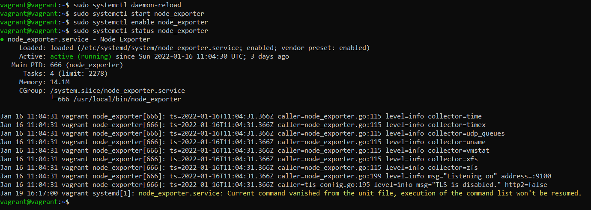

# Netology_devops_os2

1.
```
wget https://github.com/prometheus/node_exporter/releases/download/v1.3.1/node_exporter-1.3.1.linux-amd64.tar.gz
vagrant@vagrant:~$ tar xvfz node_exporter-*.*-amd64.tar.gz
node_exporter-1.3.1.linux-amd64/
node_exporter-1.3.1.linux-amd64/LICENSE
node_exporter-1.3.1.linux-amd64/NOTICE
node_exporter-1.3.1.linux-amd64/node_exporter
```

Создаем unit-файл:

```
vagrant@vagrant:~$ sudo systemctl daemon-reload
vagrant@vagrant:~$ sudo systemctl start node_exporter
vagrant@vagrant:~$ sudo systemctl enable node_exporter
```
Статус запуска сервиса Node Explorer
```
vagrant@vagrant:~$ sudo systemctl status node_exporter
```


2.
Наиболее полезными опциями мне показались такие:
```
process_cpu_seconds_total
node_schedstat_waiting_seconds_total
node_pressure_cpu_waiting_seconds_total 
node_memory_Percpu_bytes
node_softnet_dropped_total
node_softnet_processed_total
node_memory_MemAvailable_bytes  
node_memory_MemFree_bytes  
node_memory_MemTotal_bytes
node_memory_SwapCached_bytes  
node_memory_SwapFree_bytes 
node_memory_SwapTotal_bytes  
node_netstat_Tcp_ActiveOpens
node_netstat_Tcp_CurrEstab
node_netstat_Tcp_PassiveOpens
node_network_flags
node_network_iface_id
node_network_iface_link
node_network_mtu_bytes
node_network_receive_bytes_total
node_network_speed_bytes
node_network_transmit_bytes_total
node_network_up
node_disk_io_time_seconds_total
node_disk_read_bytes_total
node_disk_read_time_seconds_total
node_disk_reads_completed_total
node_disk_write_time_seconds_total
node_disk_writes_completed_total
node_disk_written_bytes_total
```
3.

4. Да, можно понять:
```
vagrant@vagrant:~$ dmesg > dmesg && cat dmesg | grep virtual*
[    0.002824] CPU MTRRs all blank - virtualized system.
[    0.083862] Booting paravirtualized kernel on KVM
[    2.683580] systemd[1]: Detected virtualization oracle.
```

5.
```
[root@756081-cj47497 ~]# sysctl fs.nr_open
fs.nr_open = 1048576
```
Максимальное количество выделенных файловых дескрипторов

Другой параметр - жесткий лимит на все дескрипторы:
```
vagrant@vagrant:~$  ulimit -Hn
1048576
```
И мягкий лимит на одного пользователя:
```
vagrant@vagrant:~$ ulimit -Sn
1024
```

6.
Делаем всё под root:
```
vagrant@vagrant:~$ sudo -i
```
Запускаем sleep через unshare:


Заходим в процесс:

7. Это так называемая fork bomb - функция fork рекурсивно вызывающая сама себя до тех пор, пока не забьёт все ресурсы системы.

Результат запуска:

   

dmesg сообщает:
```
vagrant@vagrant:~$ dmesg
```


Изменить кол-во можно вот так: 
```
$ ulimit -u 10
```